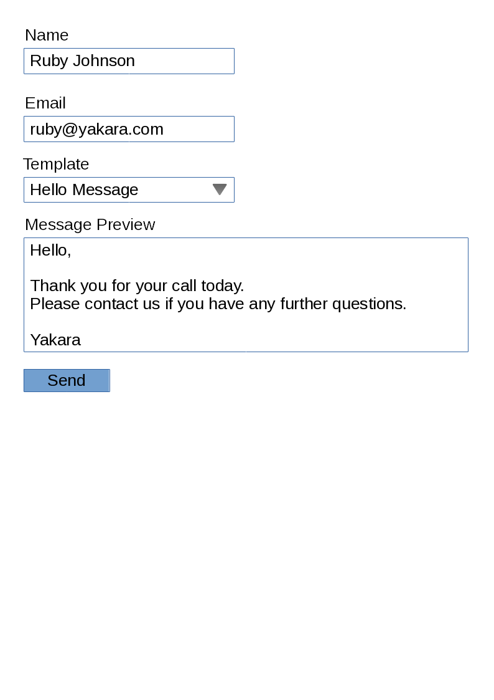

<a name="readme-top"></a>

# Yakara


## Brief
**Tech Test** allows a single user to enter a name and email address, and then choose a templated message from a drop down menu. The message is then 'sent', or in this case, saved as persistent data to a PostgresQL relational db.



## Getting Started

The first step is to fork a copy of the Piggy repository to your own account. Follow the [official instructions](https://docs.github.com/en/get-started/quickstart/fork-a-repo) from GitHub.

After completing that step, in the command line:

1. Clone your new repo by typing `git clone git@github.com:ColetteDufficy/cdufficy_yakara.git`

2. You'll need to create and seed your database:
```
# Terminal
createdb messaging
psql -d messaging -f db/messaging.sql 
```

3. Install Flask
```
# terminal
pip3 install Flask
```

4. Run Flask
You can run your web application, with the following command:
```
# terminal
flask run
```

Runs the app in the development mode.\
Open [http://localhost:5000](http://localhost:5000) to view it in your browser.
(Press CTRL+C to quit)


https://github.com/ColetteDufficy/piggy_spend_tracker/assets/90625181/b444e578-3e26-4075-9470-097af893e822

## Author

[![Website][website-shield]][linkedin-url]
[![LinkedIn][linkedin-shield]][linkedin-url]
[![GitHub][github-shield]][github-url]

[website-shield]: https://img.shields.io/badge/Colette%20Dufficy-FFD300?style=for-the-badge&logo=aboutdotme&logoColor=242424
[linkedin-shield]: https://img.shields.io/badge/LinkedIn-FFD300?style=for-the-badge&logo=linkedin&logoColor=242424
[linkedin-url]: https://linkedin.com/in/colettedufficy/
[github-shield]: https://img.shields.io/badge/GitHub-FFD300?style=for-the-badge&logo=github&logoColor=242424
[github-url]: https://github.com/ColetteDufficy


## Licence
There is currently no formal licence for this project, but this is not intended as a blanket grant of permission; the repository is public and you are permitted to clone a local copy for the demonstration purposes and/or to satisfy your own curiosity, but you would be doing so very much at your own risk as this code is provided without any warranty or guarantee of function whatsoever. It is also decidedly not for commercial use or adaptation for any other purpose at all, and is not in any way intended as a completed or production ready application; its purpose was entirely educational. In other words: it ain't our fault if you break anything after trying to use anything hosted in this repository.


<p align="right">(<a href="#readme-top">Back to Top</a>)</p> 